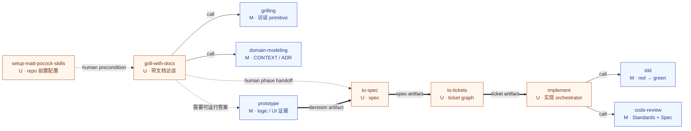
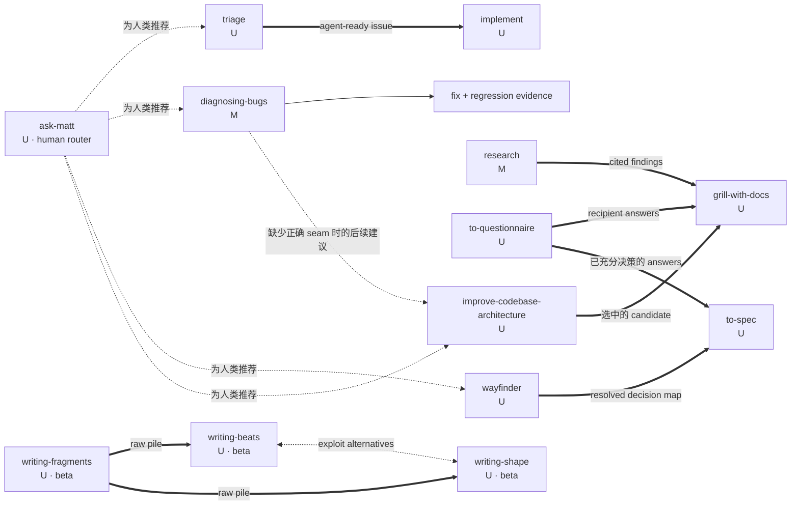
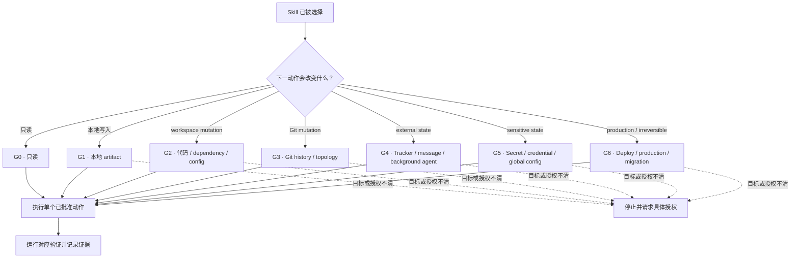

# Skills 调用方法与关系图

## 1. 文档用途

本文基于
[`vinvcn/mattpocock-skills-zh-CN@9fe7e7a3bb352851b986725bab1c7cfb17610a97`](https://github.com/vinvcn/mattpocock-skills-zh-CN/commit/9fe7e7a3bb352851b986725bab1c7cfb17610a97)
说明 36 个 Skill 的调用语义、直接依赖、阶段交接、替代关系和审批门。

逐项功能、输入、输出和风险见
[`01-目标仓库36个Skills逐项审计.md`](./01-目标仓库36个Skills逐项审计.md)。
本文只描述静态关系，不表示任何 Skill 已在 Codex、Claude Code 或 DeepSeek Harness 中实际运行。

## 2. 三类调用语义

### 2.1 `U`：User-invoked

固定仓库通过两项 metadata 把一个 Skill 标成 user-invoked：

- `SKILL.md` frontmatter 设置 `disable-model-invocation: true`。
- 同目录 `agents/openai.yaml` 设置 `policy.allow_implicit_invocation: false`。

只有人类能显式选择这类 Skill。仓库文档通常把它们写成 `/skill-name`，例如
`/grill-with-docs`。这是一种人类可读标签，不应被解释为其他 Skill 可以自动调用它。

User-invoked Skill 可以组合 model-invoked Skill，但不能调用另一个 user-invoked Skill。
因此，下列关系属于**人类阶段交接**，不是 operative call：

- `grill-with-docs → to-spec`
- `to-spec → to-tickets`
- `to-tickets → implement`
- `wayfinder → to-spec`
- `triage → implement`

### 2.2 `M`：Model-invoked

Model-invoked Skill 省略上述两个禁用字段。用户可以显式选择，模型也可以根据
`description` 中的自然语言触发条件选择。

当一个 user-invoked orchestrator 的步骤明确要求运行某个 model-invoked Skill 时，才形成
operative call。例如：

- `grill-with-docs` 调用 `grilling` 和 `domain-modeling`。
- `implement` 调用 `tdd` 和 `code-review`。
- `improve-codebase-architecture` 调用 `codebase-design`、`grilling` 和
  `domain-modeling`。

固定本地版本仍以裸 `/skill` prose 表达不少调用。上游在
[`6acc160e...6654f6b6`](https://github.com/mattpocock/skills/compare/6acc160e4e0cd062dbbbd7a1b26ae92855edf07e...6654f6b60cd9d5be8b54c6fafe44346dabeb3b76)
之间改成显式 Skill tool 调用，并把 user-invoked setup 前置条件改成“让用户运行”。
平台适配层应采用目标 harness 的原生调用机制，不应把 slash prose 当成跨平台执行协议。

### 2.3 `Internal`：仓库维护 Skill

`.skills/translate-skill` 用于上游 localization refresh。它：

- 不在顶层 README 的公开 inventory。
- 不在 Claude plugin manifest。
- 没有旁置 `agents/openai.yaml`。
- 不属于 AI 产品生命周期主链。

因此本文把它标为 `Internal`，而不把缺少
`disable-model-invocation` 解释成已证明可由模型自然触发。

## 3. 关系类型

| 关系 | 图中表示 | 定义 |
|---|---|---|
| Operative call | 实线箭头 | 当前 Skill 的步骤明确运行另一个 model-invoked Skill。 |
| Human gate / phase handoff | 虚线箭头 | 下一项是 user-invoked，必须由人类显式选择；前一项只提供产物或路由建议。 |
| Artifact handoff | 粗线或带 `artifact` 标签的虚线 | 前一阶段生成 spec、ticket、research note、prototype decision 等，后一阶段读取该 artifact。 |
| Conditional reference | 点线箭头或表格中的“条件” | 只有特定 branch 才读取 reference 或调用 Skill。 |
| Alternative | 双向虚线 | 两项处理同一职责的不同形状，应选择其一。 |
| Conflict | 冲突表 | 两份一方证据对同一行为给出不兼容说明。 |

## 4. Idea-to-ship 主链

下图把 operative call 与人类阶段交接分开。图中的 “U” 节点都需要人类显式选择。

### 主链使用边界

1. `setup-matt-pocock-skills` 只在需要 tracker/domain config 的 repo 中作为前置。
   它是 user-invoked，其他 Skill 只能要求人类先运行。
2. `grill-with-docs` 负责发现和共同决策；它不生成 implementation。
3. `prototype` 是设计问题的条件绕行，不是每项需求的必经步骤。
4. `to-spec` 只综合已有会话；它不重新完成用户研究。
5. `to-tickets` 需要用户批准 granularity 和 blocking edges，随后才允许写 tracker。
6. `implement` 的 commit 指令不能越过本项目安全门。
7. `code-review` 只报告 findings。修复 findings 是新的实现动作，不应被假定已完成。

## 5. On-ramp 与旁路

### On-ramp 解释

- **Incoming issue/PR**：`triage` 把请求转成 agent-ready brief，再由人类选择
  `implement`。由 `to-tickets` 生成的 tickets 已是 agent-ready，不再 triage。
- **已知系统损坏**：`diagnosing-bugs` 自身执行 reproduce→minimise→hypothesise→fix。
  只有 fix 后确认架构阻碍 regression test 时，才把 architecture improvement 作为后续工作。
- **超大且被 fog 包围的 effort**：`wayfinder` 只解决 decisions。路径清晰后，
  map artifact 交给 `to-spec`，不能直接跳到 `implement`。
- **架构维护**：`improve-codebase-architecture` 先 survey。用户选定 candidate 后，
  再进入带文档 grilling 和主链。
- **外部事实缺口**：`research` 产出一手来源 note；`to-questionnaire` 产出要交给
  特定 recipient 的问题。两者都提供决策材料，不替代产品决策。
- **写作 beta 流**：`writing-fragments` 是 explore；`writing-beats` 与
  `writing-shape` 是两种 exploit 方式，选择其一。

## 6. 直接 Skill-to-Skill 依赖边

下表只记录固定 `SKILL.md` 中的 operative call 或明确条件调用。README 路由和 artifact
handoff 不混入此表。

| Source | Target | 条件 | 关系性质 | 一方证据 |
|---|---|---|---|---|
| `grill-with-docs` | `grilling` | 每次调用 | Operative call | [source](https://github.com/vinvcn/mattpocock-skills-zh-CN/blob/9fe7e7a3bb352851b986725bab1c7cfb17610a97/skills/engineering/grill-with-docs/SKILL.md) |
| `grill-with-docs` | `domain-modeling` | 每次调用 | Operative call | [source](https://github.com/vinvcn/mattpocock-skills-zh-CN/blob/9fe7e7a3bb352851b986725bab1c7cfb17610a97/skills/engineering/grill-with-docs/SKILL.md) |
| `implement` | `tdd` | 预先认可的 seams，文本写“尽可能” | Operative call | [source](https://github.com/vinvcn/mattpocock-skills-zh-CN/blob/9fe7e7a3bb352851b986725bab1c7cfb17610a97/skills/engineering/implement/SKILL.md) |
| `implement` | `code-review` | 实现完成后 | Operative call | [source](https://github.com/vinvcn/mattpocock-skills-zh-CN/blob/9fe7e7a3bb352851b986725bab1c7cfb17610a97/skills/engineering/implement/SKILL.md) |
| `improve-codebase-architecture` | `codebase-design` | 初始化词汇；设计 alternative interfaces 时再次使用 | Operative/conditional call | [source](https://github.com/vinvcn/mattpocock-skills-zh-CN/blob/9fe7e7a3bb352851b986725bab1c7cfb17610a97/skills/engineering/improve-codebase-architecture/SKILL.md) |
| `improve-codebase-architecture` | `grilling` | 用户选中 candidate 后 | Operative call | [source](https://github.com/vinvcn/mattpocock-skills-zh-CN/blob/9fe7e7a3bb352851b986725bab1c7cfb17610a97/skills/engineering/improve-codebase-architecture/SKILL.md) |
| `improve-codebase-architecture` | `domain-modeling` | Grilling 中出现 domain term/ADR | Operative call | [source](https://github.com/vinvcn/mattpocock-skills-zh-CN/blob/9fe7e7a3bb352851b986725bab1c7cfb17610a97/skills/engineering/improve-codebase-architecture/SKILL.md) |
| `tdd` | `codebase-design` | Interface/seam 形状本身需要设计时 | Conditional call/reference | [source](https://github.com/vinvcn/mattpocock-skills-zh-CN/blob/9fe7e7a3bb352851b986725bab1c7cfb17610a97/skills/engineering/tdd/SKILL.md) |
| `triage` | `grilling` | Issue/PR 需要进一步充实时 | Conditional call | [source](https://github.com/vinvcn/mattpocock-skills-zh-CN/blob/9fe7e7a3bb352851b986725bab1c7cfb17610a97/skills/engineering/triage/SKILL.md) |
| `triage` | `domain-modeling` | 与 grilling 同时，维护 domain docs | Conditional call | [source](https://github.com/vinvcn/mattpocock-skills-zh-CN/blob/9fe7e7a3bb352851b986725bab1c7cfb17610a97/skills/engineering/triage/SKILL.md) |
| `wayfinder` | `grilling` | Chart map、grilling ticket、默认不确定分支 | Operative call | [source](https://github.com/vinvcn/mattpocock-skills-zh-CN/blob/9fe7e7a3bb352851b986725bab1c7cfb17610a97/skills/engineering/wayfinder/SKILL.md) |
| `wayfinder` | `domain-modeling` | 与 grilling 同时 | Operative call | [source](https://github.com/vinvcn/mattpocock-skills-zh-CN/blob/9fe7e7a3bb352851b986725bab1c7cfb17610a97/skills/engineering/wayfinder/SKILL.md) |
| `wayfinder` | `research` | Research ticket，由 sub-agent 处理 | Conditional call | [source](https://github.com/vinvcn/mattpocock-skills-zh-CN/blob/9fe7e7a3bb352851b986725bab1c7cfb17610a97/skills/engineering/wayfinder/SKILL.md) |
| `wayfinder` | `prototype` | Prototype ticket 需要 UI/logic code 时 | Conditional call | [source](https://github.com/vinvcn/mattpocock-skills-zh-CN/blob/9fe7e7a3bb352851b986725bab1c7cfb17610a97/skills/engineering/wayfinder/SKILL.md) |
| `grill-me` | `grilling` | 每次调用 | Operative call | [source](https://github.com/vinvcn/mattpocock-skills-zh-CN/blob/9fe7e7a3bb352851b986725bab1c7cfb17610a97/skills/productivity/grill-me/SKILL.md) |
| `loop-me` | `grilling` | 整个 stateful workflow interview | Operative call | [source](https://github.com/vinvcn/mattpocock-skills-zh-CN/blob/9fe7e7a3bb352851b986725bab1c7cfb17610a97/skills/in-progress/loop-me/SKILL.md) |
| `setup-ts-deep-modules` | `codebase-design` | 使用 deep-module vocabulary | Operative/reference call | [source](https://github.com/vinvcn/mattpocock-skills-zh-CN/blob/9fe7e7a3bb352851b986725bab1c7cfb17610a97/skills/in-progress/setup-ts-deep-modules/SKILL.md) |

### User-invoked 前置边

以下 source 都可能需要 setup 产物，但不能自动调用 `setup-matt-pocock-skills`：

| Source | 需要的 setup artifact |
|---|---|
| `code-review` | `docs/agents/issue-tracker.md`，用于查 spec source。 |
| `to-spec` | Issue tracker 与 triage-label vocabulary。 |
| `to-tickets` | Tracker publish 方式与 blocking 表达。 |
| `triage` | Tracker、role→label mapping、PR request-surface flag。 |
| `wayfinder` | Map、child、blocking、frontier、claim、resolve 的 tracker-specific 操作。 |

正确行为是停止当前写操作，并要求人类先显式运行 setup；不能把 setup 当作 model-invoked dependency。

## 7. 直接文件与工具依赖

| Skill | 同目录直接依赖 | 外部能力 |
|---|---|---|
| `ask-matt` | `PHASE-BOUNDARIES.md` | Session context management。 |
| `codebase-design` | `DEEPENING.md`、`DESIGN-IT-TWICE.md` | 3+ sub-agents。 |
| `diagnosing-bugs` | `scripts/hitl-loop.template.sh` | Tests、CLI、browser、debugger/profiler。 |
| `domain-modeling` | `CONTEXT-FORMAT.md`、`ADR-FORMAT.md` | Codebase、domain expert。 |
| `improve-codebase-architecture` | `HTML-REPORT.md` | Git、sub-agent、OS browser、Tailwind/Mermaid CDN。 |
| `prototype` | `LOGIC.md`、`UI.md` | Browser、project router/UI stack、Git branch。 |
| `setup-matt-pocock-skills` | GitHub/GitLab/local tracker templates、`triage-labels.md`、`domain.md` | Git、`gh` 或 `glab`。 |
| `tdd` | `tests.md`、`mocking.md` | Test runner、typechecker。 |
| `triage` | `AGENT-BRIEF.md`、`OUT-OF-SCOPE.md` | Tracker CLI、code/tests，PR branch access。 |
| `wizard` | `template.sh` | Bash、browser、`gh`、可选 shellcheck。 |
| `teach` | MISSION/RESOURCES/LEARNING-RECORD/GLOSSARY format docs | Web sources、browser、HTML/CSS/JS。 |
| `writing-for-agents` | `SKILL-MECHANICS.md` | 目标项目文档规则。 |
| `git-guardrails-claude-code` | `scripts/block-dangerous-git.sh` | Claude Code hooks、bash、`jq`。 |
| `setup-ts-deep-modules` | `dependency-cruiser.config.cjs` | Package manager、dependency-cruiser、TypeScript。 |
| `translate-skill` | Translation scripts 与 repo invariants | 固定 upstream、Git diff/tree、人工复核。 |

## 8. 替代、组合与非替代关系

| 关系 | 应如何选择 | 不能误解为 |
|---|---|---|
| `grill-me` ↔ `grill-with-docs` | 无 working directory 时选前者；有 repo 且要保留 domain docs 时选后者。 | 两项串行执行；它们共享同一个 `grilling` primitive。 |
| `writing-beats` ↔ `writing-shape` | 已有 raw pile 后二选一：前者每轮选择 beat，后者逐 block 论证结构与格式。 | 同一文章必须连续运行两项。 |
| `writing-fragments → writing-beats/writing-shape` | Fragments 是 explore；后两项是 exploit。 | Fragments 自身负责成稿。 |
| `handoff` ↔ `claude-handoff` | 前者生成可移植 temp Markdown；后者立即启动 Claude background agent。 | 等价实现。后者是 beta、Claude-specific 且副作用更高。 |
| `prototype` 的 Logic ↔ UI branch | 问题是 state/logic 时选单一 HTML；问题是视觉与信息层级时选 UI variants。 | 两个 branch 都要执行。 |
| GitHub/GitLab/local/Other tracker | 由 setup 选择一个 repo-level adapter。 | 仓库原生完整支持 Linear/Jira。Other 只有 freeform prose。 |
| `codebase-design` + `improve-codebase-architecture` | 前者是设计词汇/reference；后者是 survey/orchestrator，内部使用前者。 | 同职责替代。 |
| `tdd` + `diagnosing-bugs` | 前者构建新行为；后者先建立能捕获特定 bug 的 feedback loop。 | 所有 bug 都直接进入普通 TDD。 |
| `grill-with-docs` + `wayfinder` | 单 session 能容纳的 idea 用前者；destination 前仍有大量 fog 时用后者。 | Wayfinder 是更强的默认 planning。 |
| `research` + `to-questionnaire` | 一方事实可从 docs/code/API 获得时用 research；只存在于特定人的头脑中时用 questionnaire。 | Research 可以替人类作业务决策。 |

## 9. 已知冲突如何影响路由

| 冲突 | 路由处理 |
|---|---|
| TDD metadata 说 red-green-refactor，但 SKILL 排除 refactor | 把 red→green 与 refactor 明确拆开；review findings 只能触发新的、经批准的实现步骤。 |
| `loop-me` 要一次一个问题，`grilling` 要整轮 frontier | Beta flow 必须先选一个交互约定；不能同时声称服从两者。 |
| Model Skill 写“运行 user-invoked setup” | 停止写操作，提示人类运行 setup；不尝试自动调用。 |
| Misc README 说不进 plugin，但本地 manifest 包含它们 | 以固定 manifest 判断安装集合；README 文案只作为冲突记录。 |
| Engineering README 把 logic prototype 写成 terminal app | 以固定 `prototype/SKILL.md` 和 `LOGIC.md` 为执行契约：单一 HTML。 |
| Setup 不 provision labels | 在首次 tracker 写入前增加 label existence/auth 只读检查；缺失时请求创建授权。 |
| Architecture report 称 self-contained 但依赖 CDN | 把网络可达性与第三方脚本列为前置条件；不能把离线可查看作为事实。 |
| `translate-skill` 要保持 code fences，但 4 个 fence 有差异 | 每次 refresh 对共同文件做 exact fence diff；不能只依赖 fence-balanced check。 |
| `wait-what` 固定要求 Simplified Technical English | 中文对话中需要人类确认语言选择；本地版 multi-context repo 还需人工指定 context。 |

## 10. 安全审批门

以下 G0–G6 是本项目的整合规则（E4），不是目标仓库原生提供的权限系统。审批门可累积：
一个动作同时涉及 Git、tracker 和 secret 时，必须依次满足所有相关门。

| Gate | 允许的动作 | 进入条件 | 代表性 Skill |
|---|---|---|---|
| `G0 Read` | 只读搜索、分析、对话建议、静态报告。 | 明确 scope；不写文件、不改外部状态。 | `ask-matt`、`code-review`、`codebase-design`、`grilling`、`wait-what`。 |
| `G1 Artifact` | 写指定本地文档、测试、report 或 temp artifact。 | 确认目标路径、覆盖策略、敏感信息边界。 | `domain-modeling`、`grill-with-docs`、`handoff`、`teach`、`to-questionnaire`、写作 beta、`research` note。 |
| `G2 Workspace` | 改代码、dependency、hook、config、权限。 | 展示拟改文件；检查现有用户改动；说明验证和回滚。 | `tdd`、`diagnosing-bugs`、`setup-matt-pocock-skills`、`git-guardrails-claude-code`、`migrate-to-shoehorn`、`setup-pre-commit`、`setup-ts-deep-modules`。 |
| `G3 Git` | branch、stage、commit、merge、rebase、worktree。 | 确认 repo/branch、dirty state、exact targets、commit 边界和恢复方式。 | `implement`、`resolving-merge-conflicts`、`prototype`、`scaffold-exercises`、`setup-pre-commit`、`setup-ts-deep-modules`。 |
| `G4 External` | 创建/修改 issue、PR、label、comment、assignee，发送外部消息或启动后台 agent。 | 展示目标、payload、数量、收件人/agent、权限和停止方式；获得显式批准。 | `to-spec`、`to-tickets`、`triage`、`wayfinder`、`claude-handoff`、background `research`。 |
| `G5 Secrets` | 读取或写入 credential、`.env`、CI secret/variable、用户全局 config。 | 只展示 secret 名称而非值；确认 destination、日志脱敏、最小权限和撤销方式。 | `wizard`、global `git-guardrails-claude-code`、需要 auth 的 tracker flow。 |
| `G6 Production` | Deploy、production change、migration、cutover、不可逆第三方操作。 | Dry-run、小样本、备份、审批人、维护窗口、回滚、验证命令均已明确。 | `wizard` 的 migration/cutover branch；目标仓库没有通用 release/deploy verifier。 |

### 安全门规则

1. 选择 Skill 只表示选择方法，不表示授权该 Skill 文本中列出的全部副作用。
2. 每次审批只覆盖展示过的具体目标和 payload，不自动扩展到同类后续动作。
3. 只读检查优先于写入；能 dry-run 时先 dry-run；能小样本时先小样本。
4. `G3` 之前检查 branch、working tree 和 staged files；不得把用户现有改动夹入 commit。
5. `G4` 之前预览 issue/comment/label/close/assignee 变化；批量动作还要确认数量。
6. `G5` 中不把 secret value 写入 prompt、日志、report 或 handoff。
7. `G6` 缺少回滚或验证条件时停止。Wizard 脚本本身不构成 production readiness 证据。

## 11. 停止与失败回退

| 情况 | 停止点 | 回退 |
|---|---|---|
| User-invoked 前置未完成 | 任何 tracker/domain 写入前 | 请求人类运行 setup；先保持只读。 |
| Tracker label、sub-issue 或 dependency API 不存在 | 首次真实 tracker mutation 前 | 使用经批准的文本 fallback，或停止并补配置；不能静默假装 native relationship 已创建。 |
| Diagnosing 无 red-capable feedback loop | Hypothesis/fix 前 | 请求可复现环境、脱敏 artifact 或 instrumentation 授权。 |
| Prototype 问题类型不清 | 写 code 前 | 询问 logic 还是 UI；用户不在线时记录假设，不宣称已验证。 |
| Spec 或 ticket 未经用户确认 | 发布前 | 保持 draft，不创建真实 issue。 |
| Dirty working tree 与拟改文件重叠 | G2/G3 前 | 停止并请用户决定保留、隔离或调整 scope。 |
| Secret destination 或 target repo 不清 | G5 前 | 不读取、不写入 secret；请求具体 destination。 |
| Migration/cutover 缺备份、回滚或验证 | G6 前 | 只交付草案/checklist，不运行。 |
| Upstream/local contract 冲突 | 执行歧义出现时 | 以本项目固定 commit 为事实基线，记录 upstream 差异，要求用户决定是否先同步。 |

## 12. 静态关系结论

- 主链的 orchestrator 多为 `U`，共享纪律多为 `M`。这让人类控制阶段切换，让模型复用
  grilling、domain modeling、TDD 和 review 方法。
- 直接 operative calls 集中在少数 orchestrator；大部分箭头是 artifact handoff 或人类路由，
  不能画成自动工作流。
- 原仓库没有统一权限系统。Commit、tracker、secret、部署和生产边界必须由外层 Prompt
  Chain 加审批门。
- 目标仓库没有提供 AI Eval、安全测试、通用 deploy verification、production observability、
  增长实验或 Skill 自动晋升的完整闭环。后续模块不得仅凭这张关系图宣称这些阶段已覆盖。
